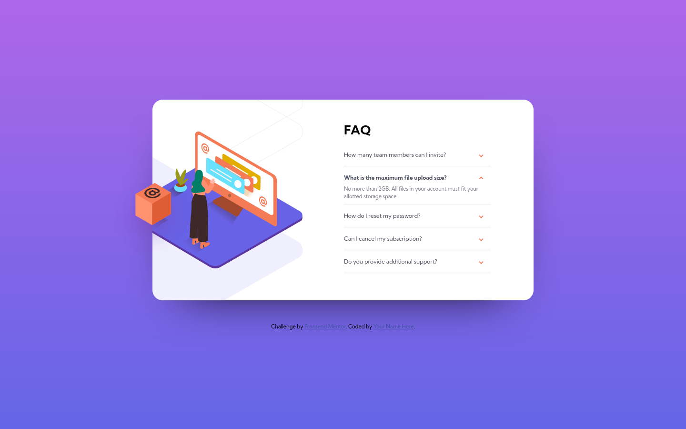
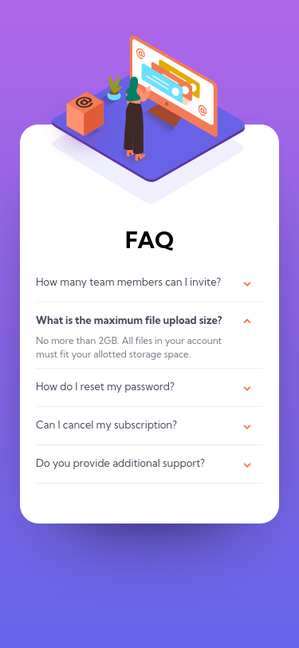

# Frontend Mentor - FAQ accordion card solution

This is a solution to the [FAQ accordion card challenge on Frontend Mentor](https://www.frontendmentor.io/challenges/faq-accordion-card-XlyjD0Oam). Frontend Mentor challenges help you improve your coding skills by building realistic projects.

## Table of contents

-   [Overview](#overview)
    -   [The challenge](#the-challenge)
    -   [Screenshot](#screenshot)
    -   [Links](#links)
-   [My process](#my-process)
    -   [Built with](#built-with)
    -   [Continued development](#continued-development)
-   [Author](#author)

## Overview

### The challenge

Users should be able to:

-   View the optimal layout for the component depending on their device's screen size
-   See hover states for all interactive elements on the page
-   Hide/Show the answer to a question when the question is clicked

### Screenshot

### Links

-   Solution URL: [GitHub](https://github.com/smccourtb/fe-faq-accordion-card)
-   Live Site URL: [GitHub Pages](https://smccourtb.github.io/fe-faq-accordion-card/)

## My process

### Built with

-   Semantic HTML5 markup
-   CSS only accordion
-   Flexbox
-   Mobile-first workflow

### What I learned

I have avoided accordions until now but they arent that bad and alot of style and usefulness to a project

### Continued development

This challenge was the trickiest for me by far. Accordions were new, as well as positioning with relative and absolute. Positioning the images were the most challenging for me so in the future I will be focusing on using position attributes more.

## Author

-   Frontend Mentor - [@smccourtb](https://www.frontendmentor.io/profile/smccourtb)
